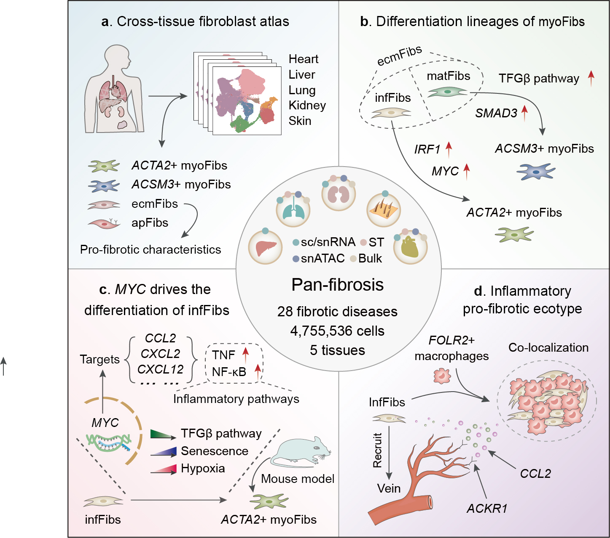

## Pan-fibrosis

Fibrosis is characterized by abnormal extracellular matrix deposition due to dysregulated tissue repair. Understanding the underlying mechanisms of fibrotic diseases depends on exploring the heterogeneity, origins, distributions, and interactions of cell subtypes. Here, we generated a comprehensive single-cell atlas of organ fibrosis, encompassing 4,755,536 cells across five tissues representing 28 fibrotic diseases. Fibroblasts, the primary effector cells in fibrosis, exhibited significant population expansion and increased cell interactions. We identified five distinct fibroblast subtypes, with inflammatory fibroblasts (infFibs) as the origin of ATAC2+ myoFibroblasts (myoFibs). MYC-regulated inflammatory pathways primarily drove the differentiation of infFibs into ATAC2+ myoFibs. Moreover, infFibs were associated with poor lung, kidney, and cardiac functions and specifically recruited venous endothelial cells (VenECs). Spatial transcriptomics analysis identified a pro-fibrotic inflammatory ecotype, consisting of infFibs and FOLR2+ macrophages, located near the VenECs. This study highlights the complexity of fibroblasts in fibrotic diseases and provides new insights for antifibrotic therapy.

 

In this repository it is possible to access to the code used in the analysis of scRNA-seq, snATAC-seq and spatial transcriptomics (Visium) of the associated manuscript.

 ### How to cite
 >  “Pan-fibrosis”

